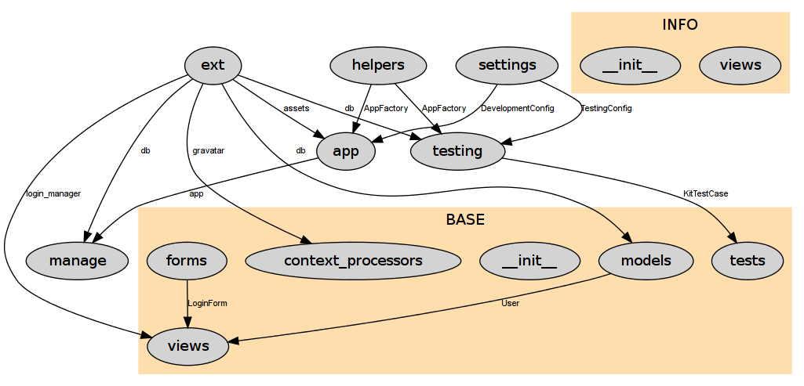

# py_xref
Scans a directory tree of python source code and builds a graph of internal imports.

## Requirements

No extra python library.

You just need a [graphviz](http://graphviz.org) `dot` executable in the path.

## example (old version of flask-kit)

